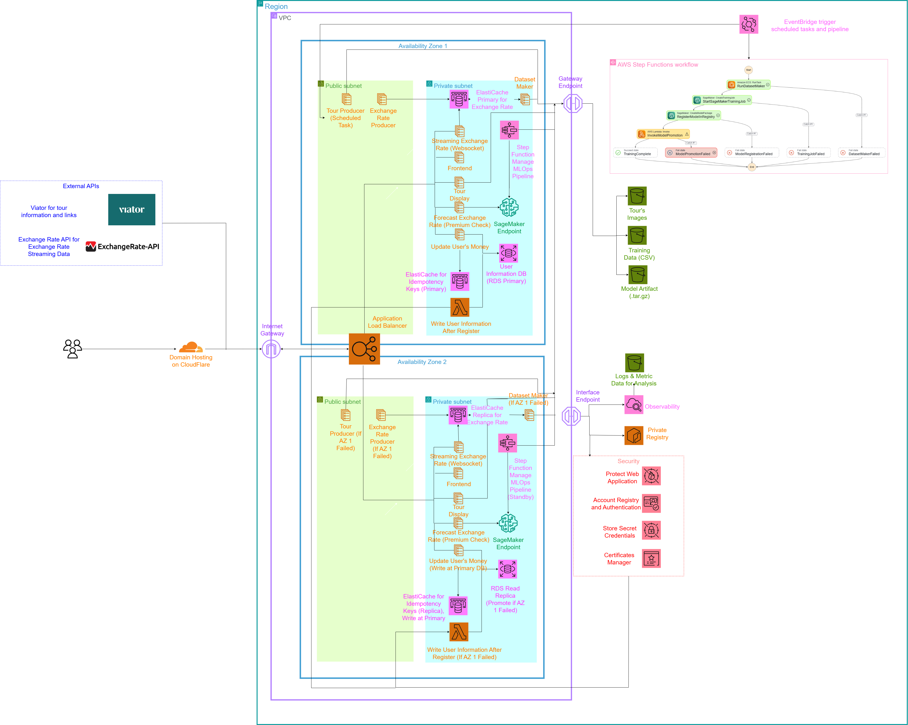

# Note
Currently, I shut down the infra for cost saving. If you want to test it, just contact me XD 
# NMCNPM Currency Exchange Platform

Ứng dụng web mô phỏng nền tảng theo dõi tỷ giá, trao đổi tiền tệ, dự báo tỷ giá bằng machine learning và gợi ý tour du lịch theo từng loại tiền tệ. Project tập trung vào thiết kế hệ thống cloud-native trên AWS, container hóa service, CI/CD, bảo mật và vận hành hạ tầng bằng Terraform.

## Tính năng chính

- Streaming tỷ giá tiền tệ theo thời gian gần thực qua WebSocket.
- Dashboard React hiển thị tỷ giá, lịch sử giao dịch, số dư và trạng thái kết nối.
- Trao đổi tiền tệ và nạp tiền giả lập với idempotency key để tránh xử lý trùng request.
- Đăng ký, đăng nhập, quên mật khẩu và phân quyền bằng AWS Cognito.
- Gói Premium cho phép gọi API dự báo tỷ giá qua SageMaker Endpoint.
- Pipeline tạo dataset, huấn luyện model và promote model tốt hơn.
- Thu thập và hiển thị tour du lịch liên quan đến quốc gia/currency, kèm affiliate redirect.
- Hạ tầng Multi-AZ trên AWS với ECS Fargate, ALB, WAF, RDS PostgreSQL, ElastiCache, S3, Lambda, Step Functions, CloudWatch và SNS.
- CI/CD với GitHub Actions: SonarQube scan, Docker build, Trivy scan, push ECR và rolling deploy ECS.

## Tech Stack

| Nhóm | Công nghệ |
|---|---|
| Frontend | React 18, TypeScript, Vite, AWS Amplify, Socket.IO client |
| Backend API | Python Flask services, Node.js/TypeScript streaming service |
| ML | scikit-learn, SageMaker Training Job, SageMaker Endpoint, Model Registry |
| Data | PostgreSQL trên RDS, Redis/Valkey trên ElastiCache, S3 |
| Auth | AWS Cognito User Pool, JWT, custom premium claim |
| Infra | Terraform, AWS ECS Fargate, ALB, WAF, VPC, Lambda, Step Functions, CloudWatch, SNS, X-Ray |
| CI/CD | GitHub Actions, Docker, ECR, SonarQube, Trivy |

## Cấu trúc repo

```text
.
├── services/
│   ├── frontend/                 # React/Vite app
│   ├── streaming-service/        # WebSocket tỷ giá realtime
│   ├── exchange-rate-producer/   # Lấy tỷ giá từ external API và ghi Redis
│   ├── money-service/            # Balance, top-up, exchange, premium upgrade
│   ├── forecast-service/         # API dự báo cho Premium user
│   ├── dataset-maker/            # One-shot task tạo CSV training data
│   ├── forecast-training/        # Training/inference container cho SageMaker
│   ├── tour-producer/            # Thu thập tour và ảnh vào S3
│   ├── tour-service/             # API đọc tour từ S3
│   ├── post-confirmation-lambda/ # Cognito trigger tạo user DB
│   └── model-promotion/          # Lambda promote model tốt hơn
├── infra/
│   ├── persistent/               # S3, ECR, ECS cluster, secrets
│   └── main_infra/               # VPC, ALB, ECS services, RDS, Redis, Cognito, ML, monitoring
├── db/db_initiate/               # SQL migration khởi tạo database
├── docs/                         # Tài liệu kiến trúc, API, deploy, vận hành
└── .github/workflows/            # CI/CD workflows
```

## Prerequisites

- Node.js 20+ và npm.
- Python 3.10+.
- Docker Desktop.
- Terraform 1.6+.
- AWS CLI v2 đã cấu hình credentials hoặc role phù hợp.
- Tài khoản AWS có quyền tạo ECS, ECR, S3, RDS, ElastiCache, Cognito, SageMaker, Lambda, IAM, ALB, WAF, CloudWatch.
- SonarQube/SonarCloud token nếu muốn chạy workflow scan source code.

## Getting Started

Clone repo: `git clone https://github.com/TheChaser-life/nmcnpm.git`

Mỗi service có `.env.example` riêng trong thư mục service. File [.env.example](./.env.example) ở root là bản tổng hợp để biết những nhóm biến nào cần chuẩn bị.


## Demo và Architecture Diagram

- Architecture diagram: 
- Link demo tại đây: `https://nmcnpm.thinhopsops.win`

## Tài liệu chi tiết

- [Architecture](./docs/ARCHITECTURE.md)
- [Deployment Guide](./docs/DEPLOYMENT.md)
- [API Documentation](./docs/API.md)
- [Operations & CI/CD](./docs/OPERATIONS.md)
- Terraform persistent layer: [infra/persistent/README.md](./infra/persistent/README.md)
- Terraform main layer: [infra/main_infra/README.md](./infra/main_infra/README.md)

## Ghi chú bảo mật

- Không commit `.env`, secret thật, API key, password DB hoặc Terraform tfvars chứa thông tin nhạy cảm.
- Các secret production nên nằm trong AWS Secrets Manager, SSM Parameter Store hoặc GitHub Actions Secrets.
- Request ghi tiền cần `Idempotency-Key` để tránh double-spend khi retry.
